# Observer Design Pattern

## Overview

The **Observer Pattern** is a behavioral design pattern that defines a one-to-many dependency between objects so that when one object changes state, all its dependents are notified and updated automatically.

> **Intent:** Define a subscription mechanism to notify multiple objects about any events that happen to the object they're observing.

### Use Case: E-Commerce Stock Notification System

**Scenario:** Amazon-like e-commerce platform where users subscribe to product notifications. When an out-of-stock product (like iPhone 15 Pro) is restocked, all subscribed users are notified through their preferred channels (Email, SMS, WhatsApp, In-App Push, Telegram, etc.).

---

## UML Arrow/Relationship Legend

| Arrow/Symbol | Name | Meaning |
|--------------|------|---------|
| `◆────────▶` | **Composition** | "owns" - strong has-a relationship |
| `────────▷` | **Inheritance** | "is-a" - extends class |
| `- - - - -▷` | **Implementation** | "implements" - interface implementation |
| `──────────▶` | **Association** | "uses" or "knows about" |
| `<<interface>>` | **Stereotype** | Marks as interface |

---

## UML Diagrams (Success Case - Fixed Implementation)

### Class Diagram (Mermaid)


#### Relationships Explained

| Relationship | What It Shows |
|--------------|---------------|
| `StockSubject <\|.. Product` | Product **implements** StockSubject interface |
| `StockObserver <\|.. EmailNotificationObserver` | EmailNotificationObserver **implements** StockObserver |
| `Product o-- StockObserver` | Product **has-a list of** StockObserver (aggregation) |

---

### Sequence Diagram - Stock Update Flow (Mermaid)


#### Sequence Diagram Arrows Explained

| Arrow | Meaning |
|-------|---------|
| `Client->>Product` | **Synchronous call** - Client calls Product |
| `Product->>Product` | **Self-call** - Product calling its own method |
| `Product-->>Client` | **Return** - Response back to caller |
| `loop For Each Observer` | **Iteration** - Repeated for all observers |

---

### Sequence Diagram - Unsubscription Flow (Mermaid)


---

### Data Flow Diagram (Mermaid)

```mermaid
flowchart TB
    subgraph Clients["Client Applications"]
        WebApp[Web App]
        MobileApp[Mobile App]
        AdminPanel[Admin Panel]
    end
    
    subgraph Subject["Subject (Observable)"]
        Product[Product<br/>iPhone 15 Pro<br/>Stock: 50]
    end
    
    subgraph ObserverList["Observer List (Subscribers)"]
        OL[observers: List&lt;StockObserver&gt;]
    end
    
    subgraph Observers["Concrete Observers"]
        Email[📧 EmailObserver<br/>alice@gmail.com]
        SMS[📱 SMSObserver<br/>+1-555-0101]
        WhatsApp[💬 WhatsAppObserver<br/>+1-555-0202]
        InApp[🔔 InAppObserver<br/>user_123]
        Telegram[✈️ TelegramObserver<br/>@dave_tech]
    end
    
    WebApp -->|subscribe| Product
    MobileApp -->|subscribe| Product
    AdminPanel -->|updateStock| Product
    
    Product -->|maintains| OL
    OL --> Email
    OL --> SMS
    OL --> WhatsApp
    OL --> InApp
    OL --> Telegram
    
    Product -->|notifyObservers| Email
    Product -->|notifyObservers| SMS
    Product -->|notifyObservers| WhatsApp
    Product -->|notifyObservers| InApp
    Product -->|notifyObservers| Telegram
```



---

### State Diagram - Product Stock State (Mermaid)


---

### Component Diagram (Mermaid)


---

## Pattern Structure (ASCII)

```
┌─────────────────────────────────────────────────────────────────────────────┐
│                         OBSERVER PATTERN STRUCTURE                          │
├─────────────────────────────────────────────────────────────────────────────┤
│                                                                             │
│   ┌───────────────────┐              ┌────────────────────────┐            │
│   │ <<interface>>     │              │    <<interface>>       │            │
│   │   Subject         │──────────────│      Observer          │            │
│   │ (StockSubject)    │   notifies   │   (StockObserver)      │            │
│   ├───────────────────┤              ├────────────────────────┤            │
│   │ +subscribe()      │              │ +update()              │            │
│   │ +unsubscribe()    │              │ +getObserverType()     │            │
│   │ +notifyObservers()│              └────────────────────────┘            │
│   └───────────────────┘                          △                         │
│            △                                     │                         │
│            │                    ┌────────────────┼────────────────┐        │
│            │                    │                │                │        │
│   ┌────────┴──────────┐  ┌──────┴─────┐  ┌──────┴──────┐  ┌─────┴──────┐  │
│   │  ConcreteSubject  │  │  Email     │  │  SMS        │  │  WhatsApp  │  │
│   │  (Product)        │  │  Observer  │  │  Observer   │  │  Observer  │  │
│   ├───────────────────┤  ├────────────┤  ├─────────────┤  ├────────────┤  │
│   │ -observers: List  │  │ +update()  │  │ +update()   │  │ +update()  │  │
│   │ -stockCount       │  └────────────┘  └─────────────┘  └────────────┘  │
│   │ +updateStock()    │                                                    │
│   └───────────────────┘                                                    │
│                                                                             │
└─────────────────────────────────────────────────────────────────────────────┘
```

---

## Data Flow Explained

### Step-by-Step Flow

```
┌──────────────────────────────────────────────────────────────────────────────┐
│                        OBSERVER PATTERN DATA FLOW                            │
├──────────────────────────────────────────────────────────────────────────────┤
│                                                                              │
│  ┌─────────────────────────────────────────────────────────────────────────┐│
│  │ STEP 1: SUBSCRIPTION                                                    ││
│  │                                                                          ││
│  │   User          Product                   Observer                      ││
│  │    │              │                          │                          ││
│  │    │  "I want to  │                          │                          ││
│  │    │  be notified │                          │                          ││
│  │    │  when iPhone │                          │                          ││
│  │    │  is in stock"│                          │                          ││
│  │    │              │                          │                          ││
│  │    │  subscribe() │                          │                          ││
│  │    │─────────────▶│                          │                          ││
│  │    │              │  add to observers list   │                          ││
│  │    │              │─────────────────────────▶│                          ││
│  │    │              │                          │                          ││
│  │    │◀─────────────│  "Subscribed!"           │                          ││
│  │                                                                          ││
│  └─────────────────────────────────────────────────────────────────────────┘│
│                                                                              │
│  ┌─────────────────────────────────────────────────────────────────────────┐│
│  │ STEP 2: STATE CHANGE (Stock Update)                                     ││
│  │                                                                          ││
│  │   Admin         Product                   Observer List                 ││
│  │    │              │                          │                          ││
│  │    │ updateStock  │                          │                          ││
│  │    │    (50)      │                          │                          ││
│  │    │─────────────▶│                          │                          ││
│  │    │              │  stockCount = 50         │                          ││
│  │    │              │                          │                          ││
│  │    │              │  notifyObservers()       │                          ││
│  │    │              │─────────────────────────▶│                          ││
│  │                                                                          ││
│  └─────────────────────────────────────────────────────────────────────────┘│
│                                                                              │
│  ┌─────────────────────────────────────────────────────────────────────────┐│
│  │ STEP 3: NOTIFICATION (Observer Update)                                  ││
│  │                                                                          ││
│  │   Product       Email         SMS          WhatsApp      User Devices   ││
│  │    │             │             │              │              │          ││
│  │    │  update()   │             │              │              │          ││
│  │    │────────────▶│             │              │              │          ││
│  │    │             │─────────────│──────────────│─────────────▶│ 📧       ││
│  │    │             │             │              │              │          ││
│  │    │  update()   │             │              │              │          ││
│  │    │─────────────│────────────▶│              │              │          ││
│  │    │             │             │──────────────│─────────────▶│ 📱       ││
│  │    │             │             │              │              │          ││
│  │    │  update()   │             │              │              │          ││
│  │    │─────────────│─────────────│─────────────▶│              │          ││
│  │    │             │             │              │─────────────▶│ 💬       ││
│  │                                                                          ││
│  │    All subscribers notified through their preferred channels!            ││
│  │                                                                          ││
│  └─────────────────────────────────────────────────────────────────────────┘│
│                                                                              │
└──────────────────────────────────────────────────────────────────────────────┘
```

---

## Failure Case Analysis (Without Observer Pattern)

### Failure Case Class Diagram (Mermaid)

```mermaid
classDiagram
    class Product {
        -productId: String
        -productName: String
        -stockCount: int
        -emailService: EmailService
        -smsService: SMSService
        -whatsAppService: WhatsAppService
        -inAppService: InAppNotificationService
        +updateStock(newCount) void
        -notifyAllSubscribers() void
    }
    
    class EmailService {
        +sendEmail(productName, message) void
    }
    
    class SMSService {
        +sendSMS(productName, message) void
    }
    
    class WhatsAppService {
        +sendWhatsApp(productName, message) void
    }
    
    class InAppNotificationService {
        +sendInAppNotification(productName, message) void
    }
    
    Product --> EmailService : creates & calls
    Product --> SMSService : creates & calls
    Product --> WhatsAppService : creates & calls
    Product --> InAppNotificationService : creates & calls
    
    note for Product "❌ PROBLEMS:\n- Tightly coupled to all services\n- Must modify for new channels\n- Cannot unsubscribe dynamically\n- Violates Open-Closed Principle"
```



### The Problematic Design

```java
// ❌ BAD: Product directly knows about and calls all notification services
public class Product {
    // Direct dependencies on ALL notification services
    private EmailService emailService;
    private SMSService smsService;
    private WhatsAppService whatsAppService;
    private InAppNotificationService inAppService;
    // ❌ Adding Telegram? Must add here!
    // ❌ Adding Slack? Must add here!
    
    public void updateStock(int newCount) {
        this.stockCount = newCount;
        if (previousStock == 0 && newCount > 0) {
            notifyAllSubscribers();  // Hardcoded calls
        }
    }
    
    private void notifyAllSubscribers() {
        // ❌ Hardcoded notification calls
        emailService.sendEmail(...);
        smsService.sendSMS(...);
        whatsAppService.sendWhatsApp(...);
        inAppService.sendInAppNotification(...);
        // ❌ Must modify THIS method for every new channel!
    }
}
```

### Problems Identified

| Problem | Description | Impact |
|---------|-------------|--------|
| **Tight Coupling** | Product knows about ALL notification services | Changes ripple through |
| **Open-Closed Violation** | Must modify Product.java to add new channels | Risk of breaking code |
| **Single Responsibility Violation** | Product manages inventory AND notifications | Class becomes bloated |
| **No Dynamic Subscription** | Cannot subscribe/unsubscribe at runtime | Poor user experience |
| **No Per-User Preferences** | Everyone gets all notifications | Spam complaints |
| **Testing Nightmare** | Cannot test without real services | Slow, unreliable tests |

### Failure Scenarios

```
SCENARIO 1: Adding Telegram Notifications
─────────────────────────────────────────
1. Create TelegramService class
2. Add field in Product: private TelegramService telegramService
3. Initialize in Product constructor
4. Add call in notifyAllSubscribers(): telegramService.send(...)
5. RISK: Breaking existing functionality
6. PROBLEM: Product.java must be modified!

SCENARIO 2: User Wants Email Only
─────────────────────────────────
1. User: "I only want email, not SMS"
2. Current design: IMPOSSIBLE
3. Workaround: Add boolean flags for each channel
4. Product becomes bloated with: enableEmail, enableSMS, enableWhatsApp...
5. Code smell: Feature envy

SCENARIO 3: Unit Testing
────────────────────────
1. Test stock update logic
2. Product creates real EmailService, SMSService, etc.
3. Test ACTUALLY sends emails!
4. Cannot mock dependencies
5. Tests are slow and have side effects
```

---

## Fixed Case Solution (With Observer Pattern)

### The Correct Design

```java
// ✅ GOOD: Observer Interface
public interface StockObserver {
    void update(String productName, String message, int stockCount, double price);
    String getObserverType();
}

// ✅ GOOD: Subject Interface
public interface StockSubject {
    void subscribe(StockObserver observer);
    void unsubscribe(StockObserver observer);
    void notifyObservers();
}

// ✅ GOOD: Concrete Observers
public class EmailNotificationObserver implements StockObserver {
    private String email;
    
    @Override
    public void update(String productName, String message, int stockCount, double price) {
        // Send email notification
    }
}

// ✅ GOOD: Concrete Subject
public class Product implements StockSubject {
    private List<StockObserver> observers = new ArrayList<>();  // Key!
    
    @Override
    public void subscribe(StockObserver observer) {
        observers.add(observer);
    }
    
    @Override
    public void unsubscribe(StockObserver observer) {
        observers.remove(observer);
    }
    
    @Override
    public void notifyObservers() {
        for (StockObserver observer : observers) {
            observer.update(productName, message, stockCount, price);
        }
    }
    
    public void updateStock(int newCount) {
        this.stockCount = newCount;
        if (previousStock == 0 && newCount > 0) {
            notifyObservers();  // Polymorphic call!
        }
    }
}
```

### Benefits Achieved

| Benefit | How It's Achieved |
|---------|-------------------|
| **Loose Coupling** | Product only knows StockObserver interface |
| **Open-Closed Principle** | Add TelegramObserver without touching Product |
| **Single Responsibility** | Product = inventory, Observers = notifications |
| **Dynamic Subscription** | subscribe()/unsubscribe() at runtime |
| **Per-User Preferences** | Each user subscribes to preferred channels |
| **Easy Testing** | Inject mock observers |

---

## When to Use Observer Pattern

### ✅ Use When:

1. **One-to-many dependency** exists between objects
2. **Multiple objects** need to react to state changes
3. **Objects don't know** each other beforehand
4. **Dynamic subscription** is needed at runtime
5. **Publish-subscribe** mechanism is required

### ❌ Don't Use When:

1. Only **one observer** exists (overkill)
2. Observers need to be notified in **specific order**
3. **Circular dependencies** might occur
4. **Simple callbacks** would suffice

---

## Real-World Applications

| Domain | Subject | Observers |
|--------|---------|-----------|
| **E-Commerce** | Product Inventory | Email, SMS, Push, WhatsApp |
| **Social Media** | User Post | Followers |
| **Stock Market** | Stock Price | Trading Apps, SMS Alerts |
| **News Portal** | News Article | Subscribers, RSS Feeds |
| **Gaming** | Player Action | Achievement System, Leaderboard |
| **IoT** | Sensor Data | Dashboard, Alerts, Logging |
| **Chat Application** | Message | Participants in Chat |
| **Event System** | Event Bus | Event Handlers |

---

## File Structure

```
desgnpatterns/
└── observer/
    ├── OBSERVER_PATTERN.md              ← This documentation
    │
    ├── failurecase/                     ← ANTI-PATTERN (What NOT to do)
    │   ├── Product.java                 ← Tightly coupled to services
    │   ├── EmailService.java            ← Direct dependency
    │   ├── SMSService.java              ← Direct dependency
    │   ├── WhatsAppService.java         ← Direct dependency
    │   ├── InAppNotificationService.java← Direct dependency
    │   └── FailureCaseDemo.java         ← Demo showing problems
    │
    └── fixedcase/                       ← CORRECT IMPLEMENTATION
        ├── StockObserver.java           ← Observer Interface
        ├── StockSubject.java            ← Subject Interface
        ├── Product.java                 ← Concrete Subject
        ├── EmailNotificationObserver.java    ← Concrete Observer
        ├── SMSNotificationObserver.java      ← Concrete Observer
        ├── WhatsAppNotificationObserver.java ← Concrete Observer
        ├── InAppNotificationObserver.java    ← Concrete Observer
        ├── TelegramNotificationObserver.java ← New Observer (extensibility)
        └── FixedCaseDemo.java           ← Demo showing solution
```

---

## How to Run

```bash
# Compile all files
cd /Users/hkalyankuma/dev/reports/IK/IK_Practice
javac -d out src/desgnpatterns/observer/failurecase/*.java
javac -d out src/desgnpatterns/observer/fixedcase/*.java

# Run failure case demo
java -cp out desgnpatterns.observer.failurecase.FailureCaseDemo

# Run fixed case demo
java -cp out desgnpatterns.observer.fixedcase.FixedCaseDemo
```

---

## Summary

| Aspect | Failure Case | Fixed Case (Observer) |
|--------|--------------|----------------------|
| Adding new notification | Modify Product class | Add new Observer class |
| Dynamic subscription | ❌ Impossible | ✅ subscribe()/unsubscribe() |
| Coupling | ❌ Tight (knows all services) | ✅ Loose (knows interface only) |
| Testing | ❌ Complex (real services) | ✅ Simple (mock observers) |
| Open-Closed | ❌ Violated | ✅ Followed |
| Single Responsibility | ❌ Violated | ✅ Followed |
| Per-user preferences | ❌ Not possible | ✅ Each user chooses channels |
| Scalability | ❌ Poor (bloated Product) | ✅ Excellent (unlimited observers) |

---

## Key Takeaways

1. **Subject maintains a list** of observers - not direct references to implementations
2. **Observers are interchangeable** - all implement the same interface
3. **One-to-many relationship** - one subject, many observers
4. **Push vs Pull model** - Subject can push data or observers can pull
5. **Dynamic subscription** - observers can join/leave at runtime
6. **Loose coupling** - subject and observers know each other only through interfaces

---

## Viewing UML Diagrams

The Mermaid diagrams in this document can be viewed in:
- **GitHub** - Native support, renders automatically
- **GitLab** - Native support, renders automatically
- **VS Code** - Install "Markdown Preview Mermaid Support" extension
- **IntelliJ IDEA** - Install "Mermaid" plugin
- **Online** - Copy diagram code to [mermaid.live](https://mermaid.live)

