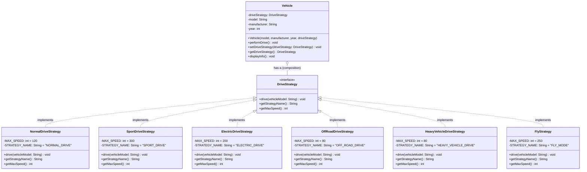

# Strategy Design Pattern

## Overview

The **Strategy Pattern** is a behavioral design pattern that lets you define a family of algorithms, put each of them into a separate class, and make their objects interchangeable.

> **Intent:** Define a family of algorithms, encapsulate each one, and make them interchangeable. Strategy lets the algorithm vary independently from clients that use it.

---

## UML Diagrams (Success Case - Fixed Implementation)

### UML Arrow/Relationship Legend

Before diving into diagrams, here's what each arrow and symbol means:

#### Class Diagram Arrows

| Arrow/Symbol | Name | Meaning | Example |
|--------------|------|---------|---------|
| `──────▶` | **Association** | "uses" or "knows about" | Vehicle uses DriveStrategy |
| `─ ─ ─ ─▶` | **Dependency** | "temporarily uses" (weak) | Client creates Vehicle |
| `◆────────` | **Composition** | "owns" (strong has-a, dies together) | Vehicle owns DriveStrategy reference |
| `◇────────` | **Aggregation** | "has" (weak has-a, independent lifecycle) | Team has Players |
| `────────▷` | **Inheritance** | "is-a" (extends class) | SportsCar extends Car |
| `- - - - -▷` | **Implementation** | "implements" (interface) | SportDriveStrategy implements DriveStrategy |
| `<<interface>>` | **Stereotype** | Marks as interface | DriveStrategy is interface |
| `-attribute` | **Private** | Only this class can access | -driveStrategy in Vehicle |
| `+method()` | **Public** | Anyone can call | +drive() is public |

#### Sequence Diagram Arrows

| Arrow | Name | Meaning |
|-------|------|---------|
| `────────▶` | **Synchronous Call** | Caller waits for response |
| `- - - - -▶` | **Asynchronous Call** | Caller doesn't wait (fire and forget) |
| `◀─ ─ ─ ─ ─` | **Return** | Response coming back |
| `────────▶` to self | **Self-call** | Object calling its own method |

#### Mermaid-Specific Syntax

| Syntax | Meaning |
|--------|---------|
| `<\|..` | Implements (dashed line with hollow arrow) |
| `<\|--` | Extends (solid line with hollow arrow) |
| `o--` | Aggregation (hollow diamond) |
| `*--` | Composition (filled diamond) |
| `-->` | Association (simple arrow) |
| `..>` | Dependency (dashed arrow) |

---

### Class Diagram (Mermaid)



#### Relationships Explained for This Diagram

| Relationship | What It Shows | Why? |
|--------------|---------------|------|
| `DriveStrategy <\|.. NormalDriveStrategy` | NormalDriveStrategy **implements** DriveStrategy interface | Dashed line with hollow arrow = interface implementation |
| `Vehicle o-- DriveStrategy` | Vehicle **has-a** DriveStrategy (composition) | Filled diamond at Vehicle = Vehicle owns the strategy reference |

**Key Point:** Notice there's NO inheritance arrow from Vehicle! Vehicle doesn't extend anything - it uses **composition** (has-a) instead of **inheritance** (is-a). This is the "favor composition over inheritance" principle in action.

### Sequence Diagram - Normal Flow (Mermaid)


#### Sequence Diagram Arrows Explained

| Arrow in Diagram | Symbol | Meaning |
|------------------|--------|---------|
| `Client->>Vehicle` | Solid arrow `─────▶` | **Synchronous call** - Client calls Vehicle and waits |
| `Vehicle->>SportDriveStrategy` | Solid arrow `─────▶` | **Delegation** - Vehicle passes control to strategy |
| `SportDriveStrategy-->>Vehicle` | Dashed arrow `- - -▶` | **Return** - Strategy returns control to Vehicle |
| `Vehicle-->>Client` | Dashed arrow `- - -▶` | **Return** - Vehicle returns control to Client |
| `+` after participant | Activation | Object is active/processing |
| `-` before return | Deactivation | Object finished processing |

**Why does Client go through Vehicle?**
The sequence shows Client → Vehicle → Strategy, never Client → Strategy directly. This is because:
1. Vehicle provides **context** (model, year, manufacturer)
2. Vehicle can **intercept** calls (add logging, validation)
3. Client doesn't need to know **which** strategy is being used

### Sequence Diagram - Adding New Strategy (Mermaid)


### State Diagram - Vehicle Drive Modes (Mermaid)

```mermaid
stateDiagram-v2
    [*] --> NormalDrive : Vehicle Created with Default
    
    NormalDrive --> SportDrive : setDriveStrategy(SportDriveStrategy)
    NormalDrive --> ElectricDrive : setDriveStrategy(ElectricDriveStrategy)
    NormalDrive --> OffRoadDrive : setDriveStrategy(OffRoadDriveStrategy)
    
    SportDrive --> NormalDrive : setDriveStrategy(NormalDriveStrategy)
    SportDrive --> ElectricDrive : setDriveStrategy(ElectricDriveStrategy)
    SportDrive --> OffRoadDrive : setDriveStrategy(OffRoadDriveStrategy)
    
    ElectricDrive --> NormalDrive : setDriveStrategy(NormalDriveStrategy)
    ElectricDrive --> SportDrive : setDriveStrategy(SportDriveStrategy)
    ElectricDrive --> OffRoadDrive : setDriveStrategy(OffRoadDriveStrategy)
    
    OffRoadDrive --> NormalDrive : setDriveStrategy(NormalDriveStrategy)
    OffRoadDrive --> SportDrive : setDriveStrategy(SportDriveStrategy)
    OffRoadDrive --> ElectricDrive : setDriveStrategy(ElectricDriveStrategy)
    
    note right of NormalDrive : Speed: 120 km/h\nMode: Comfort
    note right of SportDrive : Speed: 300 km/h\nTurbo: ON
    note right of ElectricDrive : Speed: 200 km/h\nEmission: Zero
    note right of OffRoadDrive : Speed: 80 km/h\n4WD: Engaged
```

### Component Diagram (Mermaid)


---

## Pattern Structure (ASCII)

```
┌─────────────────────────────────────────────────────────────────────────────┐
│                         STRATEGY PATTERN STRUCTURE                          │
├─────────────────────────────────────────────────────────────────────────────┤
│                                                                             │
│   ┌─────────────────┐         ┌──────────────────────────────┐             │
│   │     Context     │────────▶│    <<interface>>             │             │
│   │   (Vehicle)     │         │      Strategy                │             │
│   ├─────────────────┤         │   (DriveStrategy)            │             │
│   │ -strategy       │         ├──────────────────────────────┤             │
│   ├─────────────────┤         │ +algorithm()                 │             │
│   │ +setStrategy()  │         │ +drive(vehicleModel)         │             │
│   │ +execute()      │         └──────────────────────────────┘             │
│   │ +performDrive() │                      △                               │
│   └─────────────────┘                      │                               │
│                           ┌────────────────┼────────────────┐              │
│                           │                │                │              │
│              ┌────────────┴───┐  ┌─────────┴────┐  ┌───────┴────────┐     │
│              │ ConcreteStratA │  │ConcreteStratB│  │ ConcreteStratC │     │
│              │ (NormalDrive)  │  │ (SportDrive) │  │ (ElectricDrive)│     │
│              ├────────────────┤  ├──────────────┤  ├────────────────┤     │
│              │ +algorithm()   │  │ +algorithm() │  │ +algorithm()   │     │
│              └────────────────┘  └──────────────┘  └────────────────┘     │
│                                                                             │
└─────────────────────────────────────────────────────────────────────────────┘
```

---

## Data Flow

```
┌──────────────────────────────────────────────────────────────────────────────┐
│                              DATA FLOW DIAGRAM                               │
├──────────────────────────────────────────────────────────────────────────────┤
│                                                                              │
│  ┌─────────┐     1. Create Vehicle      ┌─────────────┐                     │
│  │ Client  │ ─────────────────────────▶ │   Vehicle   │                     │
│  │  Code   │     with Strategy          │  (Context)  │                     │
│  └─────────┘                            └──────┬──────┘                     │
│       │                                        │                            │
│       │ 2. Optional: Change                    │ 3. Delegates to            │
│       │    Strategy at Runtime                 │    Strategy                │
│       │                                        ▼                            │
│       │                                 ┌─────────────────┐                 │
│       └────────────────────────────────▶│  DriveStrategy  │                 │
│             setDriveStrategy()          │   (Interface)   │                 │
│                                         └────────┬────────┘                 │
│                                                  │                          │
│                                 4. Executes Specific Algorithm              │
│                                                  │                          │
│              ┌───────────────────────────────────┼────────────────┐         │
│              ▼                                   ▼                ▼         │
│     ┌────────────────┐              ┌────────────────┐  ┌────────────────┐  │
│     │  NormalDrive   │              │   SportDrive   │  │ ElectricDrive  │  │
│     │  Strategy      │              │   Strategy     │  │   Strategy     │  │
│     ├────────────────┤              ├────────────────┤  ├────────────────┤  │
│     │ Speed: 120km/h │              │ Speed: 300km/h │  │ Speed: 200km/h │  │
│     │ Mode: Comfort  │              │ Mode: Sport    │  │ Mode: Eco      │  │
│     └────────────────┘              └────────────────┘  └────────────────┘  │
│                                                                              │
└──────────────────────────────────────────────────────────────────────────────┘
```

---

## Failure Case Analysis (Without Strategy Pattern)

### Failure Case Class Diagram (Mermaid)


### The Problematic Design

```java
// ❌ BAD: All behaviors in one class using conditionals
public class Vehicle {
    private String vehicleType;
    
    public void drive() {
        switch (vehicleType) {
            case "CAR": 
                // Normal driving logic
                break;
            case "SPORTS_CAR":
                // Sport driving logic
                break;
            case "TRUCK":
                // Heavy vehicle logic
                break;
            // Adding new type = modifying this class!
            default:
                throw new UnsupportedOperationException();
        }
    }
}
```

### Problems Identified

| Problem | Description | Impact |
|---------|-------------|--------|
| **Open-Closed Violation** | Must modify `Vehicle.java` to add new types | Risk of breaking existing code |
| **Single Responsibility Violation** | `Vehicle` handles all drive behaviors | Class becomes bloated |
| **Code Duplication** | Similar logic repeated in switch cases | Maintenance nightmare |
| **Tight Coupling** | Vehicle type = Drive behavior | Cannot mix and match |
| **No Runtime Flexibility** | Cannot change behavior dynamically | Limited use cases |
| **Testing Difficulty** | Cannot test behaviors in isolation | Complex test setup |

### Failure Scenarios

```
SCENARIO 1: Adding Helicopter Support
─────────────────────────────────────
1. Developer receives requirement
2. Opens Vehicle.java (which they didn't write)
3. Modifies switch statement
4. Accidentally breaks TRUCK case with typo
5. Bug goes to production
6. Rollback affects all vehicle types

SCENARIO 2: Runtime Mode Switch
───────────────────────────────
1. User wants to switch Camry to Sport Mode
2. Current design: IMPOSSIBLE
3. Workaround: Create new Vehicle object
4. Problem: Loses all vehicle state
5. User experience: Poor

SCENARIO 3: Testing
───────────────────
1. Want to test just SportDrive behavior
2. Must create entire Vehicle object
3. Cannot mock the drive behavior
4. Test is slow and complex
```

---

## Fixed Case Solution (With Strategy Pattern)

### The Correct Design

```java
// ✅ GOOD: Strategy Interface
public interface DriveStrategy {
    void drive(String vehicleModel);
    int getMaxSpeed();
}

// ✅ GOOD: Concrete Strategies
public class NormalDriveStrategy implements DriveStrategy {
    @Override
    public void drive(String vehicleModel) {
        System.out.println("Normal driving: " + vehicleModel);
    }
}

public class SportDriveStrategy implements DriveStrategy {
    @Override
    public void drive(String vehicleModel) {
        System.out.println("Sport driving: " + vehicleModel);
    }
}

// ✅ GOOD: Context uses Strategy
public class Vehicle {
    private DriveStrategy driveStrategy;
    
    public Vehicle(DriveStrategy strategy) {
        this.driveStrategy = strategy;
    }
    
    public void setDriveStrategy(DriveStrategy strategy) {
        this.driveStrategy = strategy; // Runtime change!
    }
    
    public void performDrive() {
        driveStrategy.drive(model); // Delegation
    }
}
```

### Benefits Achieved

| Benefit | How It's Achieved |
|---------|-------------------|
| **Open-Closed Principle** | Add new strategy class, zero changes to Vehicle |
| **Single Responsibility** | Each strategy handles one behavior |
| **No Duplication** | Share strategies across multiple vehicles |
| **Loose Coupling** | Vehicle only knows about interface |
| **Runtime Flexibility** | `setDriveStrategy()` changes behavior |
| **Easy Testing** | Test each strategy independently |

---

## Class Diagram (ASCII)

```
┌─────────────────────────────────────────────────────────────────────────────┐
│                             CLASS DIAGRAM                                   │
├─────────────────────────────────────────────────────────────────────────────┤
│                                                                             │
│  ┌──────────────────────────────────────────────────────────────────────┐  │
│  │ fixedcase/                                                           │  │
│  ├──────────────────────────────────────────────────────────────────────┤  │
│  │                                                                      │  │
│  │    ┌─────────────────────────┐                                       │  │
│  │    │ <<interface>>           │                                       │  │
│  │    │ DriveStrategy           │                                       │  │
│  │    ├─────────────────────────┤                                       │  │
│  │    │ +drive(vehicleModel)    │                                       │  │
│  │    │ +getStrategyName()      │                                       │  │
│  │    │ +getMaxSpeed()          │                                       │  │
│  │    └───────────┬─────────────┘                                       │  │
│  │                │                                                      │  │
│  │    ┌───────────┴────────────────────────────────────────┐            │  │
│  │    │           │              │              │          │            │  │
│  │    ▼           ▼              ▼              ▼          ▼            │  │
│  │ ┌──────────┐ ┌──────────┐ ┌──────────┐ ┌──────────┐ ┌──────────┐    │  │
│  │ │ Normal   │ │ Sport    │ │ Electric │ │ OffRoad  │ │ Heavy    │    │  │
│  │ │ Drive    │ │ Drive    │ │ Drive    │ │ Drive    │ │ Vehicle  │    │  │
│  │ │ Strategy │ │ Strategy │ │ Strategy │ │ Strategy │ │ Strategy │    │  │
│  │ └──────────┘ └──────────┘ └──────────┘ └──────────┘ └──────────┘    │  │
│  │                                                                      │  │
│  │    ┌─────────────────────────┐                                       │  │
│  │    │ Vehicle (Context)       │                                       │  │
│  │    ├─────────────────────────┤                                       │  │
│  │    │ -driveStrategy          │◆─────▶ DriveStrategy                  │  │
│  │    │ -model                  │                                       │  │
│  │    │ -manufacturer           │                                       │  │
│  │    │ -year                   │                                       │  │
│  │    ├─────────────────────────┤                                       │  │
│  │    │ +performDrive()         │                                       │  │
│  │    │ +setDriveStrategy()     │                                       │  │
│  │    │ +displayInfo()          │                                       │  │
│  │    └─────────────────────────┘                                       │  │
│  │                                                                      │  │
│  └──────────────────────────────────────────────────────────────────────┘  │
│                                                                             │
│  ┌──────────────────────────────────────────────────────────────────────┐  │
│  │ failurecase/                                                         │  │
│  ├──────────────────────────────────────────────────────────────────────┤  │
│  │                                                                      │  │
│  │    ┌─────────────────────────┐                                       │  │
│  │    │ Vehicle (Monolithic)    │   ← All behaviors in one class!      │  │
│  │    ├─────────────────────────┤                                       │  │
│  │    │ -vehicleType            │                                       │  │
│  │    │ -model                  │                                       │  │
│  │    ├─────────────────────────┤                                       │  │
│  │    │ +drive()                │   ← Giant switch statement!           │  │
│  │    │ +performEmergencyDrive()│                                       │  │
│  │    └─────────────────────────┘                                       │  │
│  │                                                                      │  │
│  └──────────────────────────────────────────────────────────────────────┘  │
│                                                                             │
└─────────────────────────────────────────────────────────────────────────────┘
```

---

## Sequence Diagram (ASCII)

```
┌─────────────────────────────────────────────────────────────────────────────┐
│                           SEQUENCE DIAGRAM                                  │
├─────────────────────────────────────────────────────────────────────────────┤
│                                                                             │
│   Client          Vehicle           SportDriveStrategy                      │
│     │                │                     │                                │
│     │  new Vehicle   │                     │                                │
│     │ (SportDrive)   │                     │                                │
│     │───────────────▶│                     │                                │
│     │                │                     │                                │
│     │ performDrive() │                     │                                │
│     │───────────────▶│                     │                                │
│     │                │   drive(model)      │                                │
│     │                │────────────────────▶│                                │
│     │                │                     │ Execute sport                  │
│     │                │                     │ drive algorithm                │
│     │                │◀────────────────────│                                │
│     │◀───────────────│                     │                                │
│     │                │                     │                                │
│     │ setDriveStrategy                     │                                │
│     │ (ElectricDrive)│                     │                                │
│     │───────────────▶│                     │                                │
│     │                │                     │                                │
│     │ performDrive() │     ElectricDriveStrategy                           │
│     │───────────────▶│            │                                         │
│     │                │ drive()    │                                         │
│     │                │───────────▶│                                         │
│     │                │            │ Execute electric                        │
│     │                │            │ drive algorithm                         │
│     │                │◀───────────│                                         │
│     │◀───────────────│            │                                         │
│     │                │            │                                         │
│                                                                             │
└─────────────────────────────────────────────────────────────────────────────┘
```

---

## When to Use Strategy Pattern

### ✅ Use When:

1. **Multiple algorithms** for a specific task exist
2. **Behavior needs to change at runtime**
3. **Avoiding conditional statements** for selecting behavior
4. **Client shouldn't know algorithm details**
5. **Different variants** of an algorithm are needed

### ❌ Don't Use When:

1. Only **one or two algorithms** exist (overkill)
2. Algorithms **rarely change**
3. **Simpler solution** (like polymorphism) works
4. **Overhead** of extra classes isn't justified

---

## Real-World Applications

| Domain | Context | Strategies |
|--------|---------|------------|
| **Payment Processing** | PaymentProcessor | CreditCard, PayPal, Crypto, BankTransfer |
| **Sorting** | SortingContext | QuickSort, MergeSort, HeapSort |
| **Compression** | FileCompressor | ZIP, RAR, GZIP, BZIP2 |
| **Authentication** | AuthService | OAuth, JWT, SAML, LDAP |
| **Shipping** | ShippingCalculator | Standard, Express, Overnight, Freight |
| **Discount** | PricingEngine | PercentOff, FlatRate, BuyOneGetOne |
| **Navigation** | RouteCalculator | Fastest, Shortest, EcoFriendly |

---

## File Structure

```
desgnpatterns/
└── strategy/
    ├── STRATEGY_PATTERN.md          ← This documentation
    │
    ├── failurecase/                 ← ANTI-PATTERN (What NOT to do)
    │   ├── Vehicle.java             ← Monolithic class with switch
    │   └── FailureCaseDemo.java     ← Demo showing problems
    │
    └── fixedcase/                   ← CORRECT IMPLEMENTATION
        ├── DriveStrategy.java       ← Strategy Interface
        ├── NormalDriveStrategy.java ← Concrete Strategy
        ├── SportDriveStrategy.java  ← Concrete Strategy
        ├── ElectricDriveStrategy.java ← Concrete Strategy
        ├── OffRoadDriveStrategy.java  ← Concrete Strategy
        ├── HeavyVehicleDriveStrategy.java ← Concrete Strategy
        ├── FlyStrategy.java         ← New Strategy (extensibility demo)
        ├── Vehicle.java             ← Context class
        └── FixedCaseDemo.java       ← Demo showing solution
```

---

## How to Run

```bash
# Compile all files
cd /Users/hkalyankuma/dev/reports/IK/IK_Practice
javac -d out src/desgnpatterns/strategy/failurecase/*.java
javac -d out src/desgnpatterns/strategy/fixedcase/*.java

# Run failure case demo
java -cp out desgnpatterns.strategy.failurecase.FailureCaseDemo

# Run fixed case demo
java -cp out desgnpatterns.strategy.fixedcase.FixedCaseDemo
```

---

## Summary

| Aspect | Failure Case | Fixed Case (Strategy) |
|--------|--------------|----------------------|
| Adding new behavior | Modify existing class | Add new class |
| Runtime flexibility | ❌ Impossible | ✅ setDriveStrategy() |
| Code duplication | ❌ High | ✅ None |
| Testing | ❌ Complex | ✅ Simple |
| Open-Closed | ❌ Violated | ✅ Followed |
| Single Responsibility | ❌ Violated | ✅ Followed |
| Maintainability | ❌ Poor | ✅ Excellent |

---

## Key Takeaways

1. **Favor composition over inheritance** - Strategy uses HAS-A relationship
2. **Program to interfaces, not implementations** - DriveStrategy interface
3. **Encapsulate what varies** - Drive behaviors are encapsulated
4. **Open for extension, closed for modification** - Add strategies without changes
5. **Single Responsibility** - Each strategy does one thing well

---

## FAQ: Common Design Questions

### Q1: Why can't Client call DriveStrategy directly?

**Technically you CAN:**
```java
// Direct call - works!
DriveStrategy strategy = new SportDriveStrategy();
strategy.drive("Ferrari F8");
```

**But you SHOULDN'T because:**

| Direct Call | Through Vehicle (Context) |
|-------------|---------------------------|
| No state (model, year, manufacturer) | Full vehicle identity |
| Strategy is orphan, no owner | Strategy belongs to a vehicle |
| Cannot track history | Vehicle knows current/previous strategies |
| No pre/post processing | Can add logging, validation |
| Client must know about strategies | Client only knows about Vehicle |

**Analogy:** 
- Direct = Pressing gas pedal floating in air
- Through Vehicle = Pressing gas pedal in YOUR car with all its properties

---

### Q2: Why is Vehicle a class and not an interface?

**Vehicle IS doing things:**

```java
public class Vehicle {
    // 1. STATE MANAGEMENT - Interfaces can't have state (before Java 8)
    private String model;
    private String manufacturer;
    private int year;
    private DriveStrategy driveStrategy;
    
    // 2. BUSINESS LOGIC - Formatting, orchestration
    public void performDrive() {
        String vehicleInfo = String.format("%d %s %s", year, manufacturer, model);
        driveStrategy.drive(vehicleInfo);  // Delegation
    }
    
    // 3. BEHAVIOR - Mode switching with logging
    public void setDriveStrategy(DriveStrategy strategy) {
        System.out.println("Switching: " + this.driveStrategy.getStrategyName() 
                          + " → " + strategy.getStrategyName());
        this.driveStrategy = strategy;
    }
}
```

**When WOULD Vehicle be an interface?**
If you had vehicle hierarchy:

```java
interface Vehicle {
    void performDrive();
    void setDriveStrategy(DriveStrategy s);
}

class Car implements Vehicle { ... }
class Truck implements Vehicle { ... }
class Motorcycle implements Vehicle { ... }
```

**Current design keeps focus on Strategy Pattern, not vehicle hierarchy.**

---

### Q3: What's the difference between Composition and Aggregation?

| Aspect | Composition (◆) | Aggregation (◇) |
|--------|-----------------|-----------------|
| Relationship | Strong "owns" | Weak "has" |
| Lifecycle | Part dies with whole | Part lives independently |
| Example | Vehicle ◆── Engine | Team ◇── Players |
| In Strategy | Vehicle ◆── DriveStrategy | (not used here) |

In our pattern, Vehicle **composes** DriveStrategy - if Vehicle is destroyed, that specific strategy reference is gone (though strategy class still exists).

---

## Viewing UML Diagrams

The Mermaid diagrams in this document can be viewed in:
- **GitHub** - Native support, renders automatically
- **GitLab** - Native support, renders automatically
- **VS Code** - Install "Markdown Preview Mermaid Support" extension
- **IntelliJ IDEA** - Install "Mermaid" plugin
- **Online** - Copy diagram code to [mermaid.live](https://mermaid.live)
